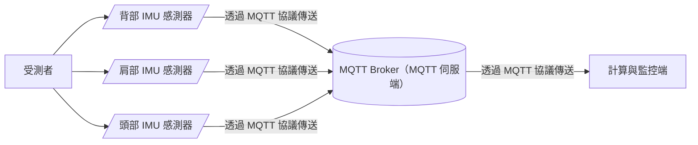

# posture-detect-using-IMU

## 引言

這篇文章是關於利用 IMU 偵測姿勢的構想（插一個諧音梗：IMU 的中文是「我是你」= I am you），會先以架構的設計開始，到後面會針對每個部分進行技術層面的介紹。

## 架構圖

### 架構圖先備知識

1. MQTT 是什麼？

   MQTT 是一種通訊協定，可將資料互相傳遞，比起現行網頁使用的 HTTP 協議更節省資源（傳遞之資料大小更小）。MQTT 在實務層面包含客戶端（client）及伺服端（server）：

   1. 客戶端（client）：不論是傳送資訊或接收資訊都稱為客戶端。
   2. 伺服端（server）：伺服端是各客戶端之間的橋樑，舉個例子：`A 客戶端` 欲發送資料給 `B 客戶端`，則實務上的傳送邏輯是 `A 客戶端` 發送資料到伺服端，`B 客戶端` 就會收到來自伺服端發送的 `A 客戶端` 資料。而伺服端的機器在 MQTT 協議中又稱為 `MQTT Broker`。

   ```mermaid
   graph LR
     A[(伺服端)]
     B[A 客戶端] --實務層面的發送資料--> A
     A --實務層面的接收資料--> C[B 客戶端]
     B -.邏輯層面的傳送資料.-> C
   ```
   
2. 有兩種形式的感測器，可偵測受測者的姿勢：
   1. 使用含有 Wi-Fi 晶片的單晶片（e.g. ESP32, D1 mini, etc.）及加速度計（e.g. GY-61, etc.）製作感測器。
   2. 利用手機作為感測器，利用內建的加速度計，透過網頁方式傳送相關數值。



## MQTT 之測試與體驗

### MQTT 測試前的先備知識

1. 主題（Topic）：在 MQTT 中，MQTT Broker 下可同時存在著許多主題，不同主題就好像無線電的不同頻道彼此獨立，使用類似電腦目錄的斜線（/）分層，例如：`testtopic/0521test` 即是 testtopic 底下的 0521test 主題。
2. 訂閱（Subscription）：若監聽一個主題，即可擷取所有傳送到該主題的資料，而這裡稱為「訂閱」並非「監聽」。

### MQTT 測試步驟

1. 打開客戶端測試用工具：http://mqtt-client.emqx.com/#/recent_connections
2. 點擊左側「+」號新增連線
3. 將 `Name` 欄位任意命名，其餘欄位不動，點擊 connect 即可連線。
4. 點擊 `New Subscription` 並輸入一個主題即可訂閱該主題。
5. 若要向一主題傳送資料，可在底部 Topic 處輸入主題路徑，接著在下方資料中編輯欲傳送的資料（預設為 JSON 格式），點擊傳送即可像主題發送資料。
6. 可嘗試使用不同裝置或頁面，一個負責訂閱，一個負責發送，體驗物聯網的世界。


---
報廢區...


## MQTT Broker（伺服端）之建置及測試


### 安裝前的先備知識

1. Terminal（終端機）：是一個 Mac 內建的應用程式，可在輸入指令換行後執行指令，是開發者的好朋友(?

### 利用 MacOS 建置 MQTT Broker

1. 安裝 Homebrew（一個套件管理工具），以方便安裝 MQTT Broker。請在 Terminal 中輸入以下指令，若視窗要求輸入密碼，請輸入電腦之開機密碼，輸入時視窗不會有任何變化，密碼輸入後按下 Enter 即可：
   ```shell
   /bin/bash -c "$(curl -fsSL https://raw.githubusercontent.com/Homebrew/install/HEAD/install.sh)"
   ```
2. 透過 Homebrew 安裝 MQTT Broker。請在 Terminal 輸入以下指令：
   ```shell
   brew install mosquitto
   ```
3. 接著透過以下指令即可啟動 MQTT Broker：
   ```shell
   brew services start mosquitto
   ```
4. 可能需要在「系統偏好設定」中的防護牆設定允許 mosquitto。
   
   
   

   資料來源：https://swf.com.tw/?p=1007
5. 若需停止 MQTT Broker，可使用以下指令：
   ```shell
   brew services stop mosquitto
   ```
